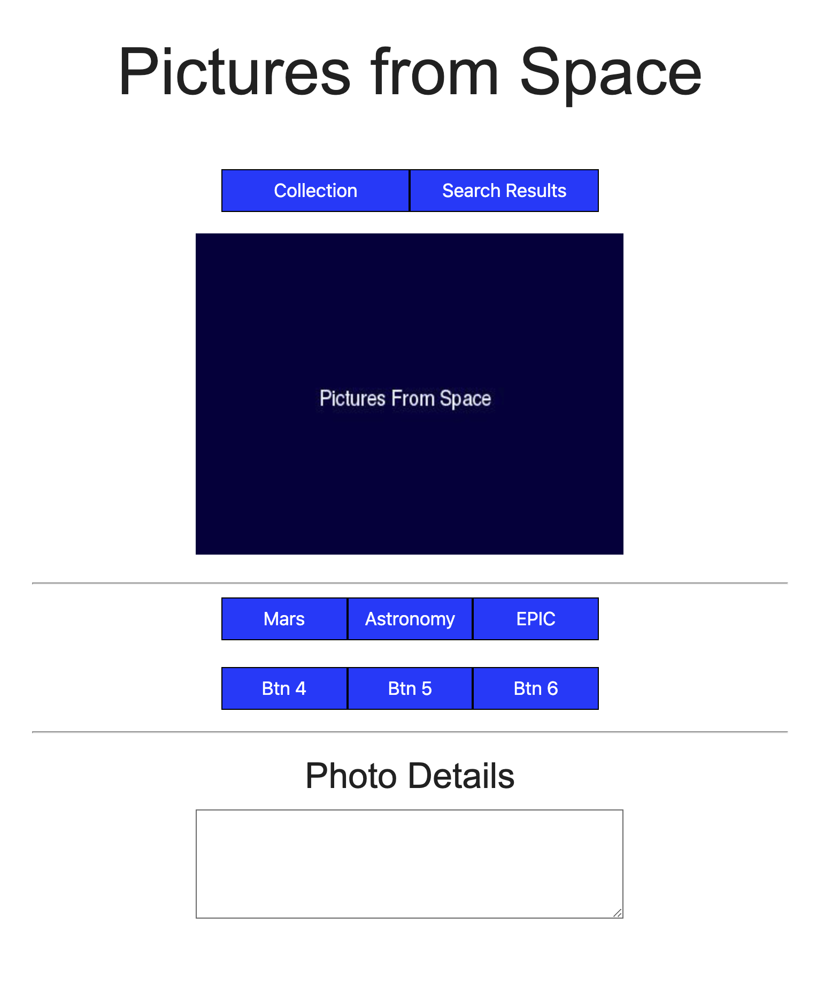

# Project-Wilder

Macks Branch active

Collection and Search Results buttons should each have on and off states with changing colors and be mutually exclusive (like radio buttons) so one will always be active and the other inactive.
When "Collection" is active, a "delete" button should appear to the left of it. 
When "Search Results" button is active, a "save" button should appear to the right of it.
There will be buttons for next and previous pictures that disappear when at last and first image. 
the Mars, Astronomy, and EPIC buttons will be used to activate the search for those catagories.

The space currently occupied by Btn 4, 5, & 6 will be the search date entry

each photo will have a little story to go with it that will appear in the details text area.

